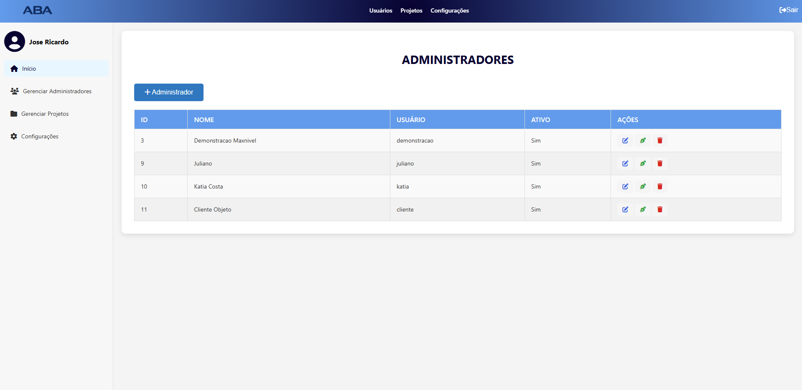

# Projeto CIMAS -MAKER

É um projeto desenvolvido através de uma parceria da Associação Brasil América (ABA) e a Formação Acelerada em Programação promovida pela SOFTEX Pernambuco e realizada com o apoio do IFPE Campus Palmares e da Usina de Arte através do Centro de Inovação da Mata Sul.

Seguido pela equipe: Carolaine Silva, Hiany Silva, Jefferson Douglas, Lucas Lins e Lucas Manoel.

## Objetivos do projeto
O movimento Maker tem ganhado força ao redor do mundo, promovendo a colaboração, a criatividade e a inovação por meio da fabricação digital e do "faça você mesmo" (DIY). O objetivo deste projeto é criar uma plataforma online que permita o compartilhamento de projetos, conhecimentos e produções da cultura Maker, facilitando a interação entre makers, entusiastas e educadores.

## Funcionalidades

- **Login e Cadastro**: A plataforma permite aos usuários se registrarem e fazerem login para acessar suas áreas personalizadas. Esse processo inclui formulários de registro e login com validação de dados, recuperação de senha e integração com sistemas de autenticação.
- **Home**: A página inicial da plataforma serve como ponto de partida para todos os usuários. Nela, são apresentadas as principais funcionalidades e novidades da comunidade Maker, incluindo projetos em destaque, acesso rápido às áreas de interesse e notícias da comunidade.  
- **Dashboard de Usuario**: Cada usuário possui uma área personalizada onde pode gerenciar seus projetos e acompanhar atividades. Esta área fornece uma visão geral das suas contribuições e ferramentas para edição e publicação de projetos.
- **Crud de Adminstrador**: Interface para administradores gerenciarem usuários, conteúdos e projetos, com funcionalidades de criar, ler, atualizar e deletar, além de controle de permissões e moderação de conteúdo, garantindo um gerencimento eficiente.

## Página Inicial

A página inicial exibe uma lista de salas e laboratórios com seus respectivos status.

## Tela de Login

A página de login permite que os usuários se autentiquem no sistema.

## Tela de Cadastro

A página de cadastro permite adicionar novos usuários ao sistema.

## Dashboard_Usuarios

Aqui você pode adicionar novas salas e laboratórios ao sistema.

## Crud de Administrador

Aqui você pode adicionar novas salas e laboratórios ao sistema.

