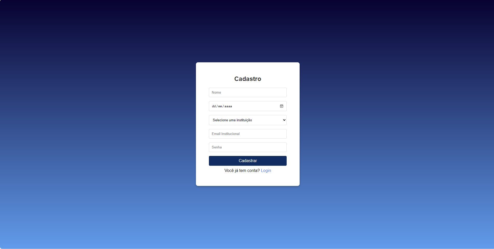

# Projeto CIMAS -MAKER

É um projeto desenvolvido através de uma parceria da Associação Brasil América (ABA) e a Formação Acelerada em Programação promovida pela SOFTEX Pernambuco e realizada com o apoio do IFPE Campus Palmares e da Usina de Arte através do Centro de Inovação da Mata Sul.

Seguido pela equipe: Carolaine Silva, Hiany Silva, Jefferson Douglas, Lucas Lins e Lucas Manoel.

## Objetivos do projeto
O movimento Maker tem ganhado força ao redor do mundo, promovendo a colaboração, a criatividade e a inovação por meio da fabricação digital e do "faça você mesmo" (DIY). O objetivo deste projeto é criar uma plataforma online que permita o compartilhamento de projetos, conhecimentos e produções da cultura Maker, facilitando a interação entre makers, entusiastas e educadores.

## Funcionalidades

- **Login e Cadastro**: Acesso seguro à aplicação com diferentes tipos de usuários.
- **Home**: Visualização de salas e laboratórios.
- **Dashboard de Usuario**: Inclusão de novas salas e laboratórios no sistema.
- **Crud de Adminstrador**: Gerenciamento de recursos que podem ser alocados em salas e laboratórios.

## Página Inicial

A página inicial exibe uma lista de salas e laboratórios com seus respectivos status.

## Tela de Login

A página de login permite que os usuários se autentiquem no sistema.

## Tela de Cadastro

A página de cadastro permite adicionar novos usuários ao sistema.

## Dashboard_Usuarios

Aqui você pode adicionar novas salas e laboratórios ao sistema.

Aqui você pode adicionar novas salas e laboratórios ao sistema.

